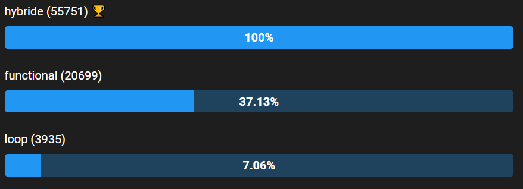
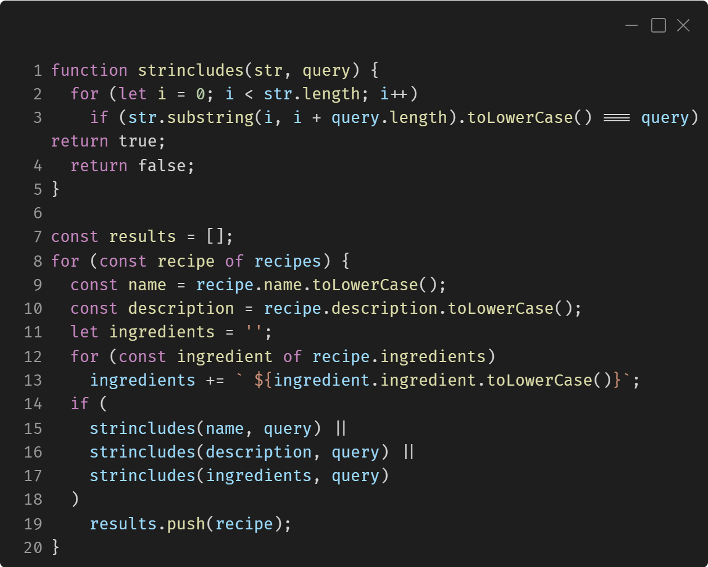
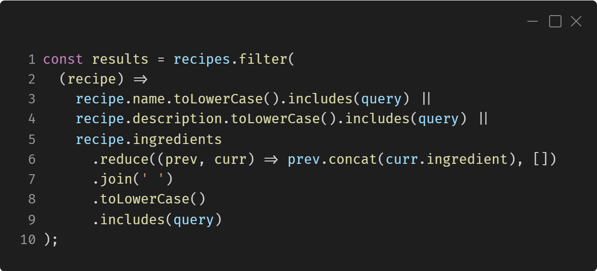
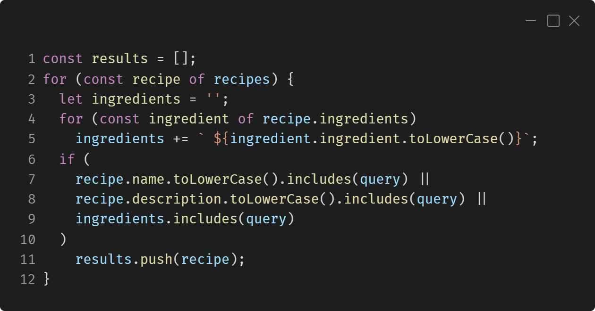
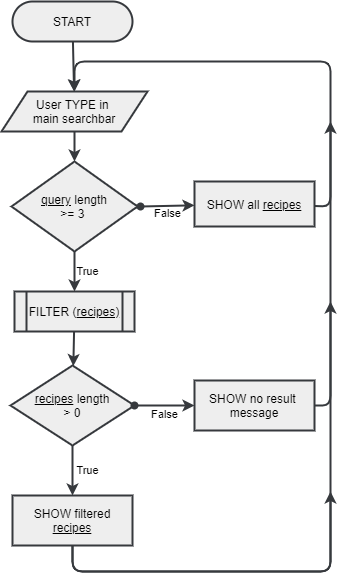

<table width=100%>
  <td width=140></td>
  <td align=right>Fiche d'investigation fonctionnalité #2</td>
</table>

<h1 align=center style="border:none;">Fiche d'investigation de fonctionnalité</h1>

<table border width=100%>
    <tr>
      <td><b>Fonctionnalité : </b>Recherche</td>
      <td><b>Fonctionnalité #2</b></td>
    </tr>
    <td colspan=2>
      <b>Problématique :</b> Pour se démarquer de la concurrence nous voulons un algorithme de recherche rapide pour que la recherche paraisse instantanée <a href="#figure4">cf. Figure 4 Flowchart</a>
    </td>
</table> 

<table border width=100%>
  <td colspan=2>
    <b>Option 1 : approche utilisant les boucles (while, for, forof, forin)</b> <a href=#figure11>cf. Figure.1.1 Code (loop)</a> 
    Dans cette option la recherche se fait à travers differentes boucles succésive 
  </td>
  <tr>
    <td>
      <b>Avantage</b>
      <ul>
        <li>lisible</li>
        <li>facilement maintenable/modifiable</li>
      </ul>
    </td>
    <td>
      <b>Incovénients</b>
      <ul>
        <li>très lent pour la comparaison de string</li>
        <li>utilise un buffer de resulat</li>
        <li>code plus verbeux (plus long)</li>
      </ul>
    </td>
  </tr>
  <td colspan=2><ul>
    <li>Score <a href="#figure0">JsBench</a> : <b>3935</b>/s</li>
    <li><b>19</b> lignes ( fonction de comparaison de string inclus )</li>
  </ul></td>
</table> 

<table border width=100%>
  <td colspan=2>
    <b>Option 2 : approche fonctionnelle (foreach, map, filter, find, reduce, ...)</b> <a href=#figure21>cf. Figure 2.1 - Code (functional)</a> 
    Dans cette option la recherche se fait grâce au fonctions membre des prototype d'objets js
  </td>
  <tr>
    <td>
      <b>Avantage</b>
      <ul>
        <li>comparaison de string très rapide</li>
        <li>n'utilise pas de buffer de resulat</li>
        <li>code plus court</li>
      </ul>
    </td>
    <td>
      <b>Incovénients</b>
      <ul>
        <li><code>Array.filter()</code> provoque plus d'instructions que <code>for..of</code></li>
        <li>moins facilement maintenable</li>
      </ul>
    </td>
  </tr>
  <td colspan=2><ul>
    <li>Score <a href="#figure0">JsBench</a> : <b>20699</b>/s ( 520%  de "loop" )</li>
    <li><b>10</b> lignes ( 52% de "loop" )</li>
  </ul></td>
</table> 

<table width=100%>
  <td width=140></td>
  <td align=right>Fiche d'investigation fonctionnalité #2</td>
</table>
  

<table border width=100%>
  <td colspan=2>
    <b>Option 3 : approche hybrid utilisant les boucles sauf pour la comparaison de string</b> <a href=#figure31>cf. Figure.3.1 Code (hybrid)</a> 
    Dans cette option la recherche se fait à travers differentes boucles succésive, mais la recherche dans une string se fait via la fonction <code>String.includes()</code>
  </td>
  <tr>
    <td>
      <b>Avantage</b>
      <ul>
        <li>baucoups plus rapide</li>
        <li>facilement maintenable/modifiable</li>
      </ul>
    </td>
    <td>
      <b>Incovénients</b>
      <ul>
        <li>utilise un buffer de resulat</li>
        <li>code un peu moins lisible</li>
      </ul>
    </td>
  </tr>
  <td colspan=2><ul>
    <li>Score <a href="#figure0">JsBench</a> : <b>55751</b>/s ( 260% de "functional" | 14100% de "loop" )</li>
    <li><b>12</b> lignes ( +20% de "functional" )</li>
  </ul></td>
</table> 

<table border width=100%><td>
<b>Solution retenue :</b>  
L'objectif étant la performance, j'ai retenue l'approche "hybrid", qui est de très loin la plus perfomante en plus d'être facilement maintenable.
</td></table> 

<table width=100%>
  <td width=140></td>
  <td align=right>Fiche d'investigation fonctionnalité #2</td>
</table>

## Annexes

Figure 0 - Benckmark <a href="https://jsben.ch/se1io">JsBench</a>

 
 

Figure 1.1 - Code (loop)

<table width=100%>
  <td width=140></td>
  <td align=right>Fiche d'investigation fonctionnalité #2</td>
</table>

 
 

Figure 2.1 - Code (functional)

 
 

Figure 3.1 - Code (hybrid)

<table width=100%>
  <td width=140></td>
  <td align=right>Fiche d'investigation fonctionnalité #2</td>
</table>

 
 
 
 

Figure 4 - Flowchart

